<div align="center">

  

  # 💳 KasKu: Smart Cash Flow & Expense Tracker

  **Aplikasi Manajemen Keuangan Pribadi Cerdas & Pelacak Pengeluaran Modern berbasis Android dengan Jetpack Compose, Material 3, dan Integrasi Kecerdasan Buatan (Google Gemini & LM Studio).**

  <p align="center">
    <a href="https://github.com/iqsanazhr/KasKu/releases"></a>
    
    
    
    
    
    
    
    
  </p>

</div>

---

## 🎨 KasKu Corporate Brand Manual & Presentation Deck (v1.1.0)

> **Panduan Identitas Visual & Dokumen Presentasi Resmi (Full Slide Deck)**.  
> Klik pada gambar slide mana pun untuk membuka penampil interaktif dengan animasi dan mode presentasi layar penuh:  
> [🖥️ **Buka Interactive Web Viewer (Full Screen PPT Mode)**](docs/KasKu_Brand_Manual_Viewer.html) &bull; [📥 **Unduh PDF Resmi (2.25 MB)**](docs/KasKu_Brand_Manual_Landscape.pdf) &bull; [📖 **Spesifikasi Dokumen Markdown**](docs/BRANDING_COMPANY_BOOK.md)

<p align="center">
  <a href="docs/KasKu_Brand_Manual_Viewer.html">
    
  </a>
  &nbsp;
  <a href="docs/KasKu_Brand_Manual_Landscape.pdf">
    
  </a>
  &nbsp;
  <a href="docs/BRANDING_COMPANY_BOOK.md">
    
  </a>
</p>

---

### 📑 Slide 1 / 7 — Cover & Back Cover
<a href="docs/KasKu_Brand_Manual_Viewer.html">
  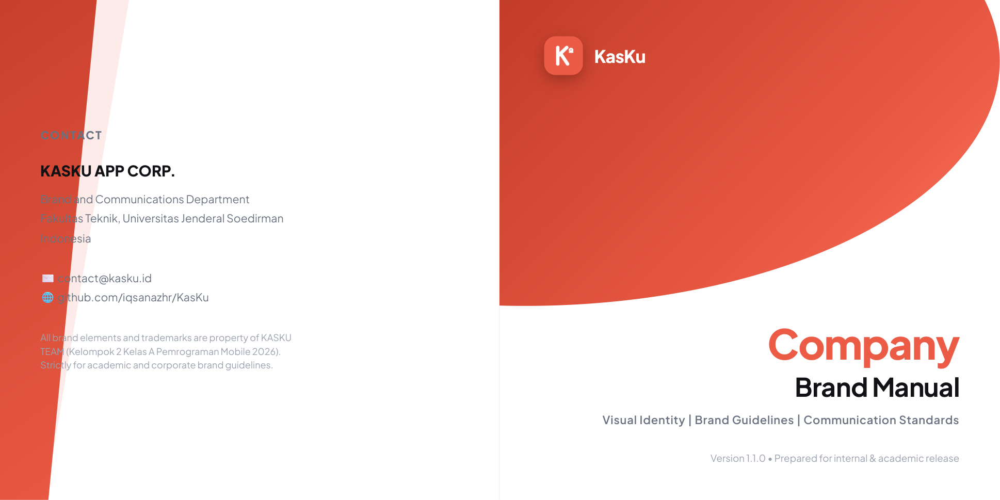
</a>

---

### 📑 Slide 2 / 7 — Table of Contents & About Us
<a href="docs/KasKu_Brand_Manual_Viewer.html">
  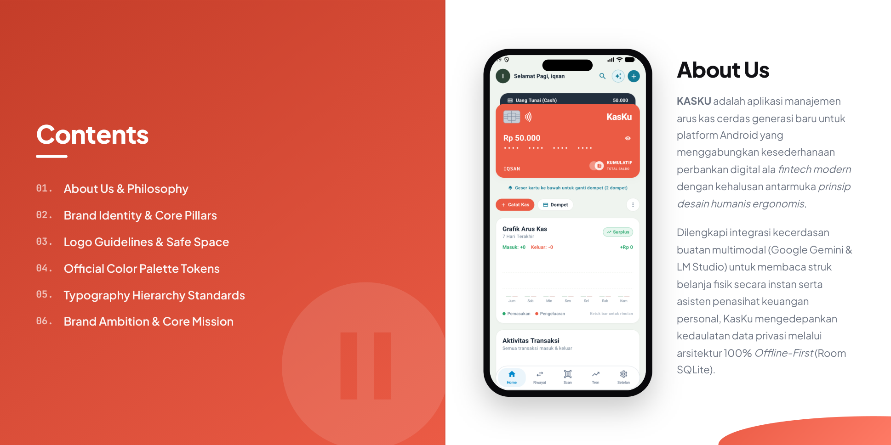
</a>

---

### 📑 Slide 3 / 7 — Brand Identity & Value Pillars ($K^2$)
<a href="docs/KasKu_Brand_Manual_Viewer.html">
  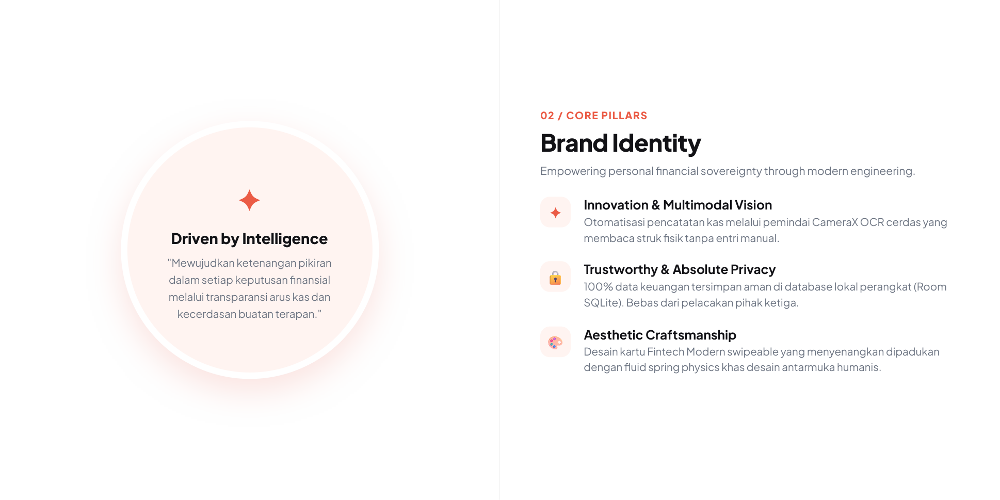
</a>

---

### 📑 Slide 4 / 7 — Color Palette & Logo Construction Guidelines
<a href="docs/KasKu_Brand_Manual_Viewer.html">
  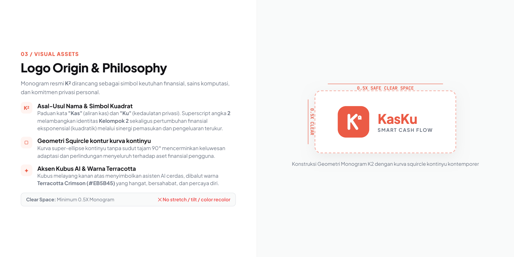
</a>

---

### 📑 Slide 5 / 7 — Typography System & Scale Hierarchy
<a href="docs/KasKu_Brand_Manual_Viewer.html">
  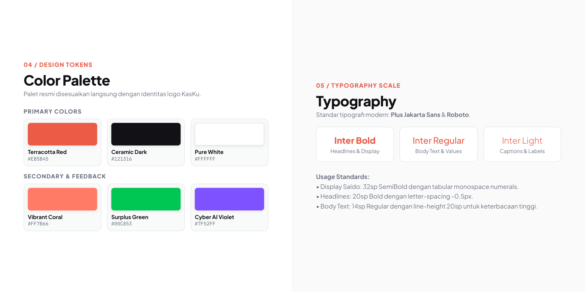
</a>

---

### 📑 Slide 6 / 7 — Brand Philosophy, Vision & Mission Diagram
<a href="docs/KasKu_Brand_Manual_Viewer.html">
  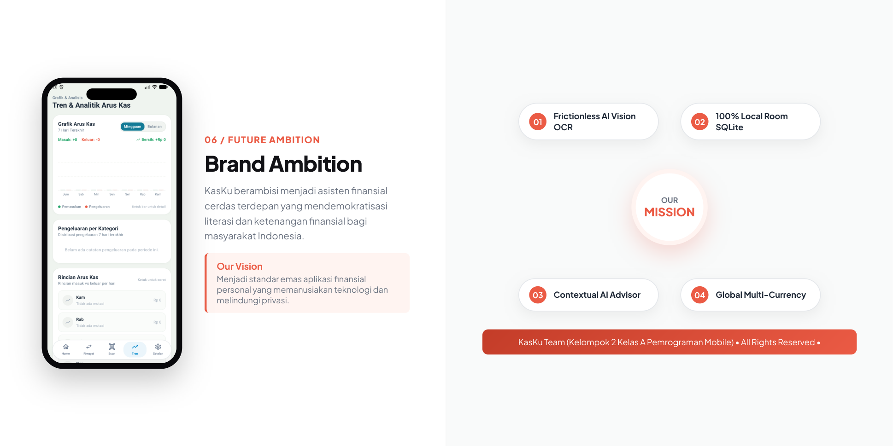
</a>

---

### 📑 Slide 7 / 7 — Production App Showcase (4 Screens)
<a href="docs/KasKu_Brand_Manual_Viewer.html">
  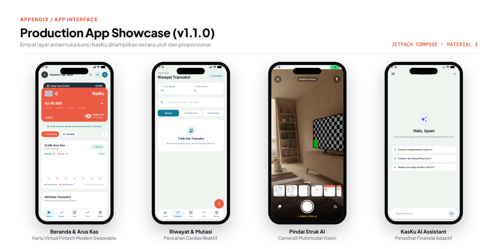
</a>

---

## 📱 Production App Showcase (Mockup Smartphone Berbingkai)

Empat layar antarmuka kunci KasKu dibungkus dengan desain bingkai smartphone modern (Dynamic Island & Bezel Titanium) beresolusi tinggi:

<table>
  <tr>
    <td width="25%" align="center" valign="top">
      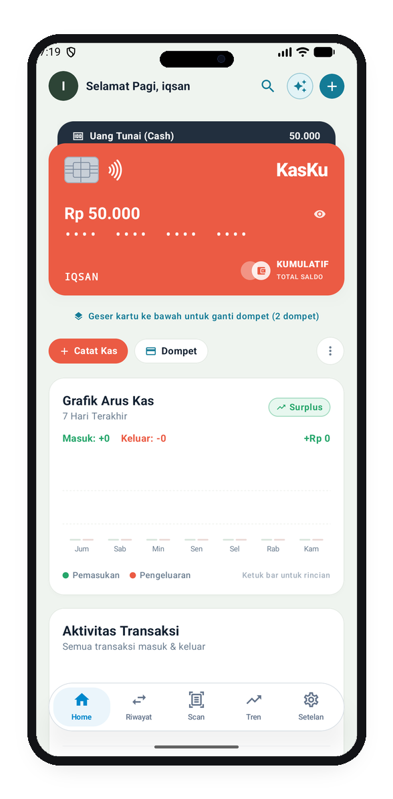
      <br/>
      <strong>1. Beranda & Arus Kas</strong>
      <br/>
      <small>Kartu Debit Virtual Fintech Modern, Saldo Kumulatif & Grafik 7 Hari</small>
    </td>
    <td width="25%" align="center" valign="top">
      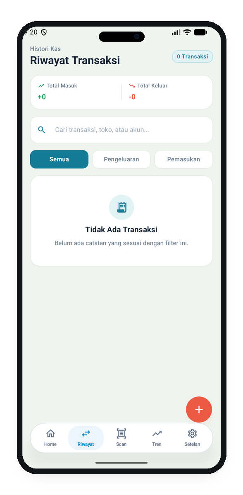
      <br/>
      <strong>2. Riwayat Transaksi</strong>
      <br/>
      <small>Agregasi Mutasi (+/-), Filter Tab Kategori & Pencarian Merchant Cerdas</small>
    </td>
    <td width="25%" align="center" valign="top">
      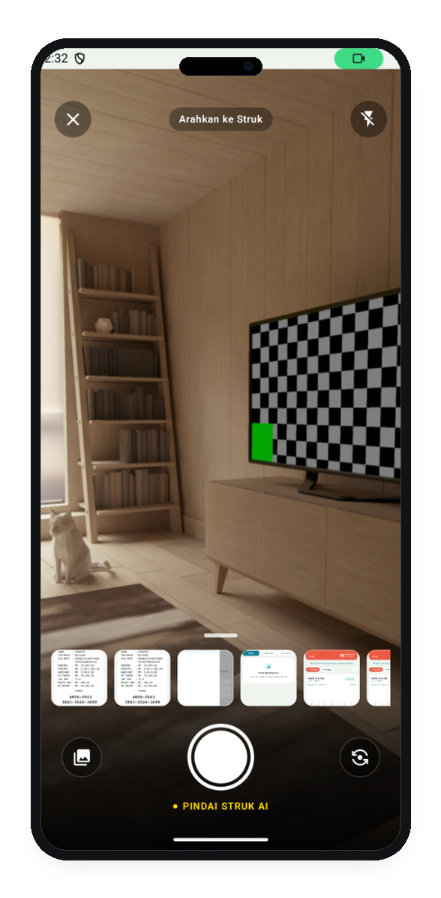
      <br/>
      <strong>3. Pindai Struk AI Vision</strong>
      <br/>
      <small>Jendela Bidik CameraX, Kontrol Flash, & Ekstraksi Multimodal OCR</small>
    </td>
    <td width="25%" align="center" valign="top">
      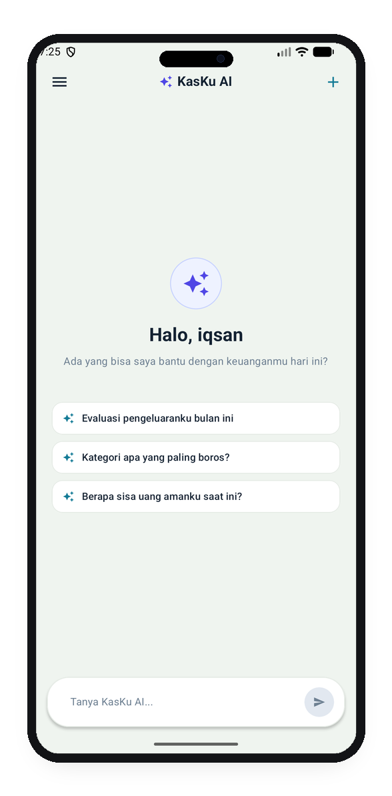
      <br/>
      <strong>4. KasKu AI Assistant</strong>
      <br/>
      <small>Konsultan Finansial Adaptif, Grounding Kurs Live & Riwayat Sesi</small>
    </td>
  </tr>
</table>

---

## 📖 Tentang KasKu

**KasKu** adalah aplikasi pencatatan keuangan pribadi cerdas untuk perangkat Android yang dirancang dengan perpaduan estetika perbankan digital ala *fintech modern* dan kehalusan antarmuka *prinsip desain humanis ergonomis*. KasKu tidak hanya mencatat uang masuk dan keluar secara konvensional, melainkan menyematkan kecerdasan buatan (*Artificial Intelligence*) untuk mengenali struk belanja secara otomatis (*AI Vision OCR*) dan bertindak sebagai asisten penasihat keuangan pribadi (*Personal Financial Advisor*).

Aplikasi ini mengedepankan prinsip **Offline-First & Privacy-Focused**, di mana seluruh data transaksi finansial tersimpan aman di database lokal perangkat Anda tanpa ketergantungan cloud wajib.

---

## 📸 Rincian Seluruh Layar & Fitur Aplikasi

Berikut adalah dokumentasi visual antarmuka pengguna KasKu beserta fungsionalitas utama pada tiap halamannya:

### 1. 🚀 Splash Screen & Loading Brand
<table>
  <tr>
    <td width="320" align="center">
      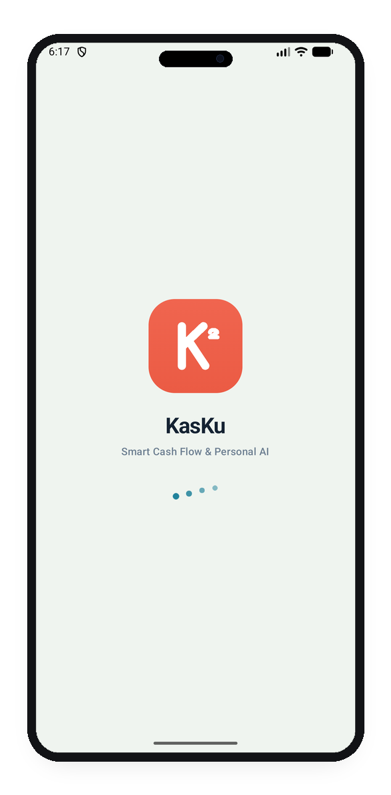
    </td>
    <td>
      <h4>Fitur & Fungsionalitas:</h4>
      <ul>
        <li><strong>Branding Elegan</strong>: Menampilkan logo KasKu $K^2$ berlatar belakang bernuansa <i>Ceramic Dark</i>.</li>
        <li><strong>Transisi Halus</strong>: Dilengkapi animasi fade-in (300ms) dan fade-out (450ms) yang mulus saat inisialisasi aplikasi.</li>
        <li><strong>Inisialisasi Data Lokal</strong>: Menjalankan sinkronisasi awal Room Database dan pengecekan preferensi onboarding di latar belakang.</li>
      </ul>
    </td>
  </tr>
</table>

### 2. 🏠 Beranda & Arus Kas Real-Time (*Dashboard*)
<table>
  <tr>
    <td width="320" align="center">
      
    </td>
    <td>
      <h4>Fitur & Fungsionalitas:</h4>
      <ul>
        <li><strong>Header Personal</strong>: Sapaan waktu dinamis (<i>"Selamat Pagi, iqsan"</i>) lengkap dengan avatar profil, tombol pencarian transaksi, dan tombol cepat input mutasi (<code>+</code>).</li>
        <li><strong>Pintasan KasKu AI (<code>✦</code>)</strong>: Akses instan satu ketukan ke asisten cerdas KasKu AI di kanan atas layar.</li>
        <li><strong>Kartu Dompet Virtual Interaktif</strong>: Visualisasi kartu debit fintech modern berwarna Terracotta dengan saldo aktif, gesture geser untuk beralih antar rekening (Uang Tunai, Bank, E-Wallet), serta sakelar <i>Kumulatif Total Saldo</i>.</li>
        <li><strong>Aksi Cepat</strong>: Tombol <i>Catat Kas</i> dan <i>Kelola Dompet</i> untuk transaksi harian tanpa hambatan.</li>
        <li><strong>Grafik Arus Kas 7 Hari</strong>: Bar chart interaktif perbandingan pemasukan vs pengeluaran harian dengan indikator status <i>Surplus / Defisit</i>.</li>
        <li><strong>Dynamic Capsule Bottom Bar</strong>: Bilah navigasi bawah mengambang (*floating capsule*) dengan sudut membulat, hairline border 0.5dp, bayangan lembut, dan active pill indicator.</li>
      </ul>
    </td>
  </tr>
</table>

### 3. 📑 Riwayat & Pencarian Transaksi
<table>
  <tr>
    <td width="320" align="center">
      
    </td>
    <td>
      <h4>Fitur & Fungsionalitas:</h4>
      <ul>
        <li><strong>Ringkasan Saldo Mutasi</strong>: Kartu metrik total uang masuk (+Rp) dan total uang keluar (-Rp) secara teragregasi.</li>
        <li><strong>Pencarian Cerdas</strong>: Filter pencarian instan berdasarkan nama transaksi, toko/merchant, maupun nama akun dompet.</li>
        <li><strong>Tab Kategori</strong>: Filter satu sentuhan untuk memilah daftar mutasi: <i>Semua</i>, <i>Pengeluaran</i>, atau <i>Pemasukan</i>.</li>
        <li><strong>Empty State Informatif</strong>: Ilustrasi bersih saat belum ada mutasi pada filter yang dipilih.</li>
        <li><strong>Floating Action Button (FAB)</strong>: Tombol melayang merah di sudut kanan bawah untuk mencatat transaksi baru kapan saja.</li>
      </ul>
    </td>
  </tr>
</table>

### 4. 🧾 Pindai Struk AI (*Smart Vision OCR*)
<table>
  <tr>
    <td width="320" align="center">
      
    </td>
    <td>
      <h4>Fitur & Fungsionalitas:</h4>
      <ul>
        <li><strong>Kamera Native CameraX</strong>: Antarmuka jendela bidik kamera responsif dengan rasio layar penuh dan panduan posisi struk (<i>"Arahkan ke Struk"</i>).</li>
        <li><strong>Kontrol Pencahayaan</strong>: Tombol sakelar senter/flash kamera untuk pengambilan gambar di kondisi minim cahaya.</li>
        <li><strong>Impor Foto Galeri</strong>: Fleksibilitas memilih nota pembayaran yang sudah tersimpan di galeri foto perangkat.</li>
        <li><strong>Ekstraksi Multimodal AI</strong>: Mengirimkan citra struk ke AI Vision untuk mendeteksi merchant, tanggal transaksi, rincian barang, dan total tagihan tanpa input manual.</li>
      </ul>
    </td>
  </tr>
</table>

### 5. 📈 Tren & Analitik Arus Kas
<table>
  <tr>
    <td width="320" align="center">
      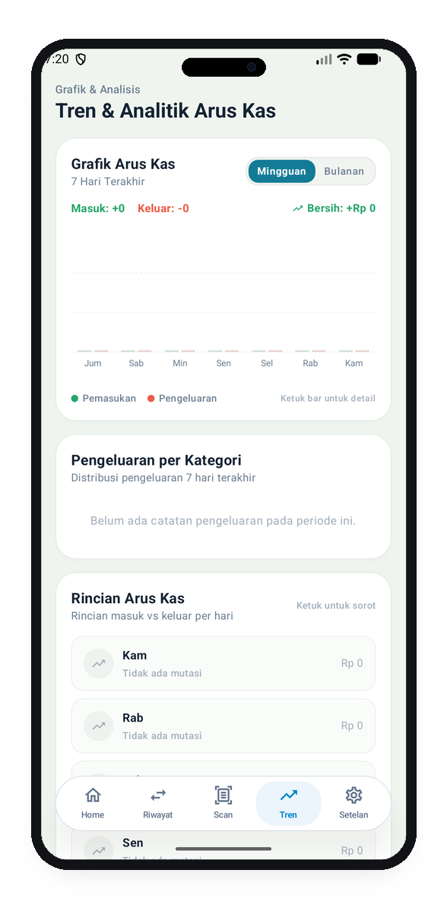
    </td>
    <td>
      <h4>Fitur & Fungsionalitas:</h4>
      <ul>
        <li><strong>Pengalih Periode Fleksibel</strong>: Sakelar beralih tampilan antara data <i>Mingguan (7 Hari Terakhir)</i> dan data <i>Bulanan</i>.</li>
        <li><strong>Indikator Arus Kas Bersih (*Net Cash Flow*)</strong>: Kalkulasi otomatis selisih pemasukan dan pengeluaran secara transparan (<i>Surplus / Defisit</i>).</li>
        <li><strong>Analisis Distribusi Pengeluaran</strong>: Pemetaan kategori belanja untuk mendeteksi pos pengeluaran yang paling boros (*spending leakage*).</li>
        <li><strong>Rincian Arus Kas Harian</strong>: Riwayat mutasi per hari (Senin s.d. Minggu) untuk memantau ritme belanja mingguan pengguna.</li>
      </ul>
    </td>
  </tr>
</table>

### 6. ⚙️ Pengaturan, Multi-Wallet & Konfigurasi AI
<table>
  <tr>
    <td width="320" align="center">
      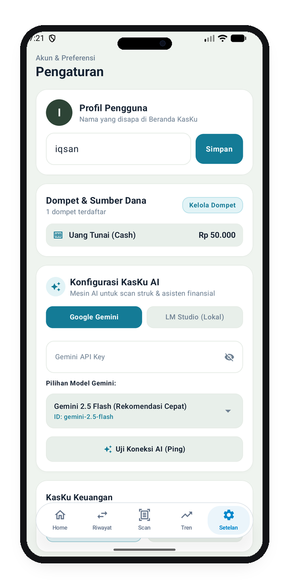
      <br/><em>(Bagian Atas: Profil, Dompet & AI)</em>
    </td>
    <td width="320" align="center">
      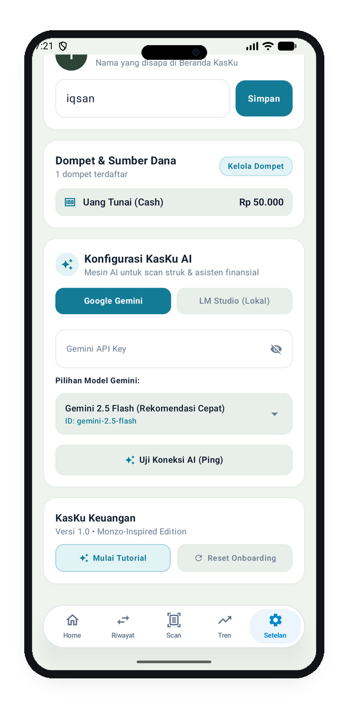
      <br/><em>(Bagian Bawah: Uji AI & Panduan)</em>
    </td>
  </tr>
  <tr>
    <td colspan="2">
      <h4>Fitur & Fungsionalitas:</h4>
      <ul>
        <li><strong>Profil Pengguna</strong>: Kustomisasi nama pengguna yang digunakan sebagai sapaan personal di Beranda.</li>
        <li><strong>Multi-Currency System (Pilihan Mata Uang Dinamis)</strong>: Pemilihan mata uang utama aplikasi secara instan dengan dukungan 9 mata uang dunia (🇮🇩 IDR - Rp, 🇺🇸 USD - $, 🇪🇺 EUR - €, 🇸🇬 SGD - S$, 🇲🇾 MYR - RM, 🇯🇵 JPY - ¥, 🇬🇧 GBP - £, 🇦🇺 AUD - A$, 🇸🇦 SAR - SR) yang reaktif mengubah simbol di seluruh layar secara real-time.</li>
        <li><strong>Kurs Valuta Asing Real-Time (Retrofit REST API)</strong>: Kartu kurs nilai tukar valas live dari endpoint <code>open.er-api.com</code> dengan arsitektur <code>UiState</code> (Idle, Loading, Success, Error) dan tombol refresh interaktif.</li>
        <li><strong>Manajemen Dompet</strong>: Pengaturan saldo awal, penambahan rekening bank, e-wallet, atau kas tunai.</li>
        <li><strong>Dual AI Engine Support</strong>:
          <ul>
            <li><strong>Google Gemini (Cloud)</strong>: Koneksi resmi ke API Google Gemini menggunakan API Key pribadi.</li>
            <li><strong>LM Studio (Local LLM)</strong>: Opsi privat untuk menjalankan model bahasa lokal tanpa koneksi internet luar.</li>
          </ul>
        </li>
        <li><strong>Dynamic Model Discovery Google Gemini</strong>: Tombol <i>"Cek Izin & Sinkron Model"</i> yang secara otomatis menginspeksi endpoint Google Generative Language API dan menampilkan seluruh model aktif yang dapat diakses oleh API Key tersebut (termasuk <code>Gemini 3.8 Flash</code>, <code>Gemini 3.6 Flash</code>, <code>Gemini 2.5 Flash</code>, dll.).</li>
        <li><strong>Input Model Manual (Kustom)</strong>: Dialog fleksibel untuk mengetikkan nama model ID eksperimental atau model khusus Google lainnya secara bebas.</li>
        <li><strong>Diagnostik Koneksi AI</strong>: Tombol <i>"Uji Koneksi AI (Ping)"</i> untuk memeriksa validitas API key dan status server secara real-time.</li>
        <li><strong>Pusat Panduan</strong>: Tombol <i>"Mulai Tutorial"</i> untuk meninjau kembali tur fitur dan <i>"Reset Onboarding"</i>.</li>
      </ul>
    </td>
  </tr>
</table>

### 7. 🤖 KasKu AI Assistant & Manajemen Sesi Obrolan
<table>
  <tr>
    <td width="320" align="center">
      
    </td>
    <td>
      <h4>Fitur & Fungsionalitas:</h4>
      <ul>
        <li><strong>Asisten Keuangan Generatif</strong>: Berdialog interaktif seputar strategi anggaran, evaluasi pengeluaran bulanan, dan tips finansial berbasis data riil pengguna.</li>
        <li><strong>Kartu Saran Cepat (*Quick Prompt Chips*)</strong>:
          <ul>
            <li>✦ <i>"Evaluasi pengeluaranku bulan ini"</i></li>
            <li>✦ <i>"Kategori apa yang paling boros?"</i></li>
            <li>✦ <i>"Berapa sisa uang amanku saat ini?"</i></li>
          </ul>
        </li>
        <li><strong>Navigation Drawer Riwayat Sesi</strong>:
          <ul>
            <li>Tombol <strong>+ Chat Baru</strong> untuk memulai percakapan topik baru tanpa tercampur konteks sebelumnya.</li>
            <li>Daftar riwayat sesi obrolan terdahulu yang tersimpan rapi dan dapat dihapus per sesi.</li>
            <li>Pintasan cepat kembali ke Beranda, menu Pengaturan AI, dan pembersihan total riwayat obrolan.</li>
          </ul>
        </li>
      </ul>
    </td>
  </tr>
</table>

---

## 🏗️ Struktur & Arsitektur Proyek

KasKu menerapkan prinsip arsitektur **MVVM (Model-View-ViewModel)** berpadu dengan kaidah **Clean Architecture** yang terstruktur rapi:

```text
D:\kasku\
├── 📂 app/
│   ├── 📂 src/
│   │   ├── 📂 main/
│   │   │   ├── 📂 java/com/example/kasku/
│   │   │   │   ├── 📂 data/
│   │   │   │   │   ├── 📂 local/          # Room DB, Entity (Transaction, Wallet, Chat), & DAOs
│   │   │   │   │   ├── 📂 preferences/    # DataStore Preferences (AiPreferences & UserPreferences)
│   │   │   │   │   ├── 📂 remote/         # AiService (Gemini REST API & LM Studio OkHttp client)
│   │   │   │   │   └── 📂 repository/     # KasKuRepository (Single source of truth data layer)
│   │   │   │   ├── 📂 domain/
│   │   │   │   │   └── 📂 model/          # Business logic data models & Category enums
│   │   │   │   ├── 📂 ui/
│   │   │   │   │   ├── 📂 components/     # Reusable UI widgets, Cards, Dialogs, & Modern Bottom Sheets
│   │   │   │   │   ├── 📂 navigation/     # NavHost, Screen routes, & FloatingLiquidBottomBar
│   │   │   │   │   ├── 📂 screens/        # Dashboard, Transactions, Scanner, Chat, Trends, Settings
│   │   │   │   │   └── 📂 theme/          # Color, Type, Shape, & Theme styling
│   │   │   │   └── 📄 MainActivity.kt     # Single Activity orchestrator & root Compose Host
│   │   │   └── 📂 res/                    # Vector Drawables, Mipmap Icons, Layouts, AndroidManifest
│   │   └── 📂 test/                       # Unit & Instrumental Testing
│   └── 📄 build.gradle.kts                # Modul app dependencies (Compose, Room, CameraX, KSP)
├── 📂 docs/                               # 📸 Aset dokumentasi, Brand Book PDF, & Mockups
│   ├── 📂 mockups/                        # 📱 Screenshot berbingkai smartphone (Dynamic Island & Titanium)
│   ├── 📄 KasKu_Brand_Manual_Viewer.html  # 🖥️ Interactive Web Viewer & Full Screen PPT Presenter
│   ├── 📄 KasKu_Brand_Manual_Landscape.pdf# 📥 Dokumen resmi PDF 2:1 Landscape (Print-ready)
│   └── 📄 BRANDING_COMPANY_BOOK.md        # 📘 Panduan identitas visual & filosofi merek
├── 📄 build.gradle.kts                    # Root build configuration
├── 📄 settings.gradle.kts                 # Repositori & plugin Gradle declaration
└── 📄 README.md                           # Dokumentasi utama repositori GitHub
```

---

## 🛠️ Tech Stack & Dependensi Utama

| Kategori | Teknologi | Deskripsi Penggunaan |
|---|---|---|
| **Bahasa Utama** | **Kotlin 2.0+** | Bahasa pemrograman modern dengan Coroutines & Flow |
| **Antarmuka (UI)** | **Jetpack Compose + Material 3** | Pembangunan antarmuka deklaratif dengan token Material Design 3 |
| **Navigasi** | **Compose Navigation** | Pengaturan alur antar layar dengan single-activity architecture |
| **Penyimpanan Lokal** | **Room Database (SQLite)** | Penyimpanan mutasi, histori transaksi, dompet, dan riwayat chat (100% Offline-First) |
| **Preferensi** | **Jetpack DataStore** | Penyimpanan kunci API dan pengaturan onboarding secara aman |
| **Kamera & Gambar** | **CameraX + Coil 3** | Antarmuka kamera OCR struk dan perenderan gambar asinkron |
| **Jaringan & REST API** | **Retrofit 2 + OkHttp 3 + Kotlinx Serialization** | Klien REST API kurs valas (Retrofit 2) & HTTP client AI Gemini/LM Studio (OkHttp 3) |
| **Kecerdasan Buatan** | **Google Gemini & LM Studio** | Model multimodal AI vision struk dan chatbot analitik finansial |

---

## ⚡ Cara Menjalankan Aplikasi (*Quick Start*)

### Prasyarat
1. **Android Studio**: Android Studio Ladybug (2024.2+) atau Android Studio Meerkat (2024.3+).
2. **JDK**: Java Development Kit versi 17 atau 21.
3. **Android Device / Emulator**: Android 10 (API level 29) hingga Android 16 (API level 36).

### Langkah Menjalankan
1. **Clone Repositori**:
   ```bash
   git clone https://github.com/iqsanazhr/KasKu.git
   cd KasKu
   ```

2. **Buka di Android Studio**:
   - Jalankan Android Studio, pilih **Open**, dan arahkan ke folder `KasKu`.
   - Tunggu proses **Gradle Sync** hingga selesai.

3. **Jalankan Aplikasi**:
   - Pilih perangkat fisik (via USB Debugging / Wi-Fi) atau Emulator Android.
   - Tekan tombol **Run** (`Shift + F10`) di toolbar Android Studio.

---

## 🔑 Konfigurasi KasKu AI

Untuk mengaktifkan fitur cerdas pemindai struk dan chatbot penasihat finansial:

1. Buka tab **Setelan** di pojok kanan bawah bilah navigasi KasKu.
2. Pada bagian **Konfigurasi KasKu AI**, tentukan mesin yang ingin digunakan:
   - **Google Gemini**: Dapatkan API Key gratis di [Google AI Studio](https://aistudio.google.com/). Tempelkan API Key pada kolom input, lalu ketuk **"Cek Izin & Sinkron Model"** untuk memuat seluruh model aktif yang tersedia di akun Anda (mendukung hingga `Gemini 3.8 Flash`, `Gemini 3.6 Flash`, `Gemini 2.5 Flash`, atau input manual kustom).
   - **LM Studio (Offline)**: Nyalakan server lokal pada aplikasi LM Studio PC Anda (default: `http://192.168.x.x:1234/v1`) untuk pemrosesan AI 100% tanpa internet.
3. Ketuk tombol **Uji Koneksi AI (Ping)** untuk memastikan koneksi berhasil terhubung.

---

## 👥 Anggota Kelompok 2 (Kelas A - Pemrograman Mobile 2026)

Berikut adalah susunan anggota tim pengembang aplikasi KasKu yang diurutkan berdasarkan Nomor Induk Mahasiswa (NIM):

| No | Foto / Avatar | Nama Mahasiswa | NIM | Peran & Kontribusi Utama |
|:---:|:---:|:---|:---:|:---|
| 1 | 👨‍💻 | **Iqsan Azhar Nuryadi** | `H1D024009` | **Lead Architect & UI/UX Specialist**: Perancangan konsep UI/UX Fintech Modern & Human-Centered Design, arsitektur tema, reusable components, dan sistem multi-currency dinamis. |
| 2 | 📊 | **Surung Nicholas Manalu** | `H1D024017` | **Core Feature & State Management**: Implementasi `DashboardScreen`, stack kartu virtual swipeable, formulir transaksi (`AddTransactionSheet`), dan alur state UDF. |
| 3 | 🗄️ | **Izaz Falih** | `H1D024034` | **Database & Repository Architect**: Perancangan skema relasional Room SQLite (5 entitas 3NF), DAO reaktif, enkripsi preferensi DataStore, dan repository pattern. |
| 4 | 🤖 | **Najmi Zahrian** | `H1D024038` | **AI Vision & Network Engineer**: Integrasi kamera CameraX, Gemini Multimodal Vision OCR struk belanja, Retrofit 2 REST API kurs live, dan discovery model dinamis. |

---

## 🚀 Catatan Rilis (*Release Changelog*)

### [v1.1.0] - 2026-10-02 (Multi-Currency, Dynamic AI Discovery, & Interactive App Tour)
- 💱 **Sistem Multi-Currency Dinamis & Konversi Real-Time**:
  - Pilihan 9 mata uang utama dunia (IDR, USD, EUR, SGD, MYR, JPY, GBP, AUD, SAR) dengan pembaruan simbol dan nilai tukar live.
  - Seluruh saldo di Beranda, Riwayat, Grafik Tren, dan formulir input mutasi otomatis berkonversi secara dinamis mengikuti mata uang yang dipilih di Pengaturan.
  - Basis data SQLite tetap menyimpan nilai pokok dalam Rupiah (IDR) secara konsisten dan lossless tanpa merusak integritas skema.
- 🌐 **Kurs Valuta Asing Real-Time & AI Grounding**:
  - Integrasi Retrofit 2 REST API (`open.er-api.com`) dengan arsitektur `UiState` interaktif pada kartu kurs.
  - Asisten Keuangan AI kini dibekali pengetahuan kurs live (Grounding Context) untuk menjawab pertanyaan seputar konversi valas secara akurat.
  - OCR Vision Scanner otomatis mendeteksi struk valas (USD, SGD, EUR, MYR) dan mengonversikan total ke estimasi Rupiah secara cerdas.
- 🤖 **Dynamic Google Gemini Model Discovery & Inline Sync**:
  - Tombol sinkronisasi model inline yang ringkas di samping kolom input API Key.
  - Otomatis mengecek izin koneksi dan mengambil daftar model resmi yang didukung akun Google AI Studio pengguna (hingga `Gemini 3.8 Flash`, `Gemini 3.6 Flash`, `Gemini 2.5 Flash`, serta input manual kustom).
- 🧭 **Panduan Interaktif Menyeluruh (*Interactive Guided Tour*)**:
  - Perluasan fitur spotlight walkthrough tutorial (`FeatureTutorialOverlay`) ke 5 layar utama aplikasi: Beranda, Riwayat Transaksi, Tren & Analitik, Pengaturan, dan KasKu AI Chat.

### [v1.0.0] - 2026-10-01 (Gold Master Release)
- 📱 Rilis publik perdana KasKu Smart Cash Flow & Expense Tracker.
- 🎨 Jetpack Compose UI Material 3 berlandaskan prinsip Fintech Modern & Human-Centered Design Guidelines.
- 💾 Arsitektur data lokal reaktif Room SQLite dengan 5 entitas terelasi 3NF (100% Offline-First).
- 🧾 CameraX + Gemini Vision OCR untuk pemindaian struk belanja otomatis.
- 💬 Chatbot Konsultan Finansial berbasis LLM dengan manajemen sesi percakapan.

---

## 📄 Lisensi

Proyek ini dilisensikan di bawah lisensi **[MIT License](LICENSE)**. Anda bebas menggunakan, memodifikasi, dan mendistribusikan kode ini untuk keperluan pembelajaran maupun pengembangan lebih lanjut.
